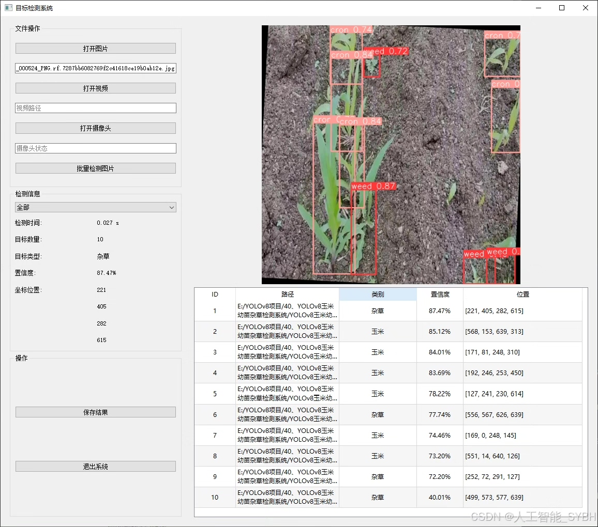
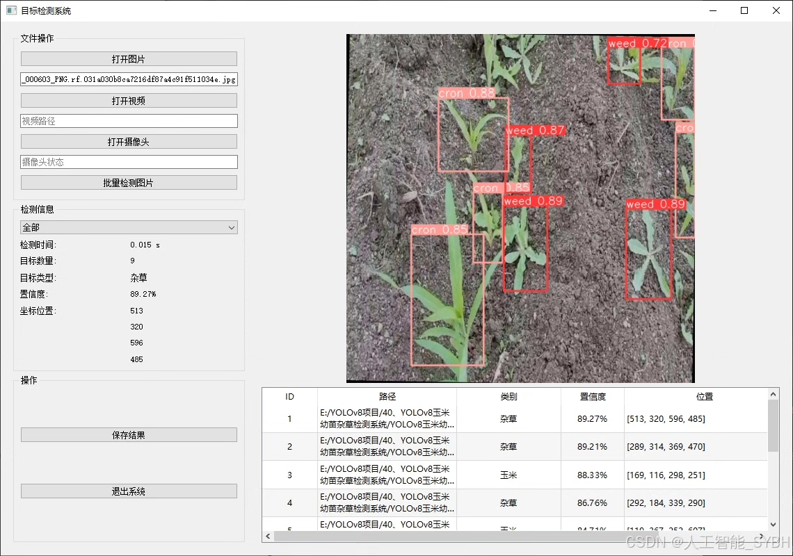
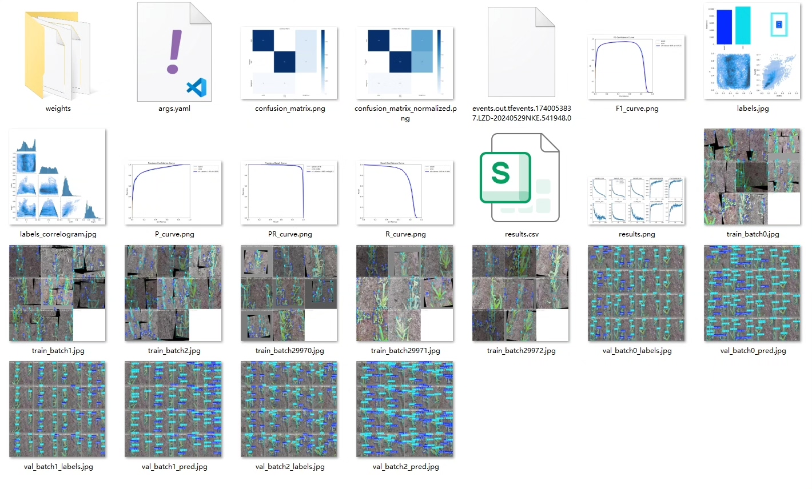
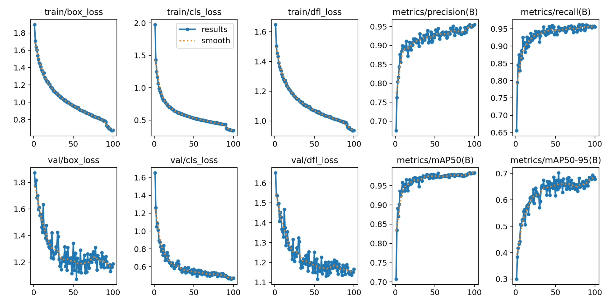
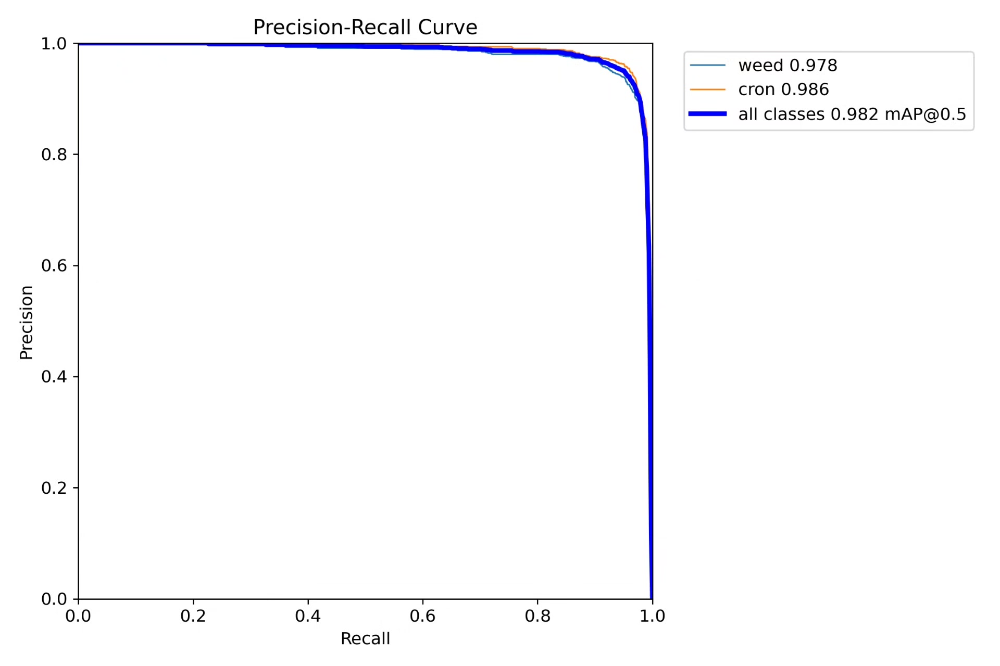
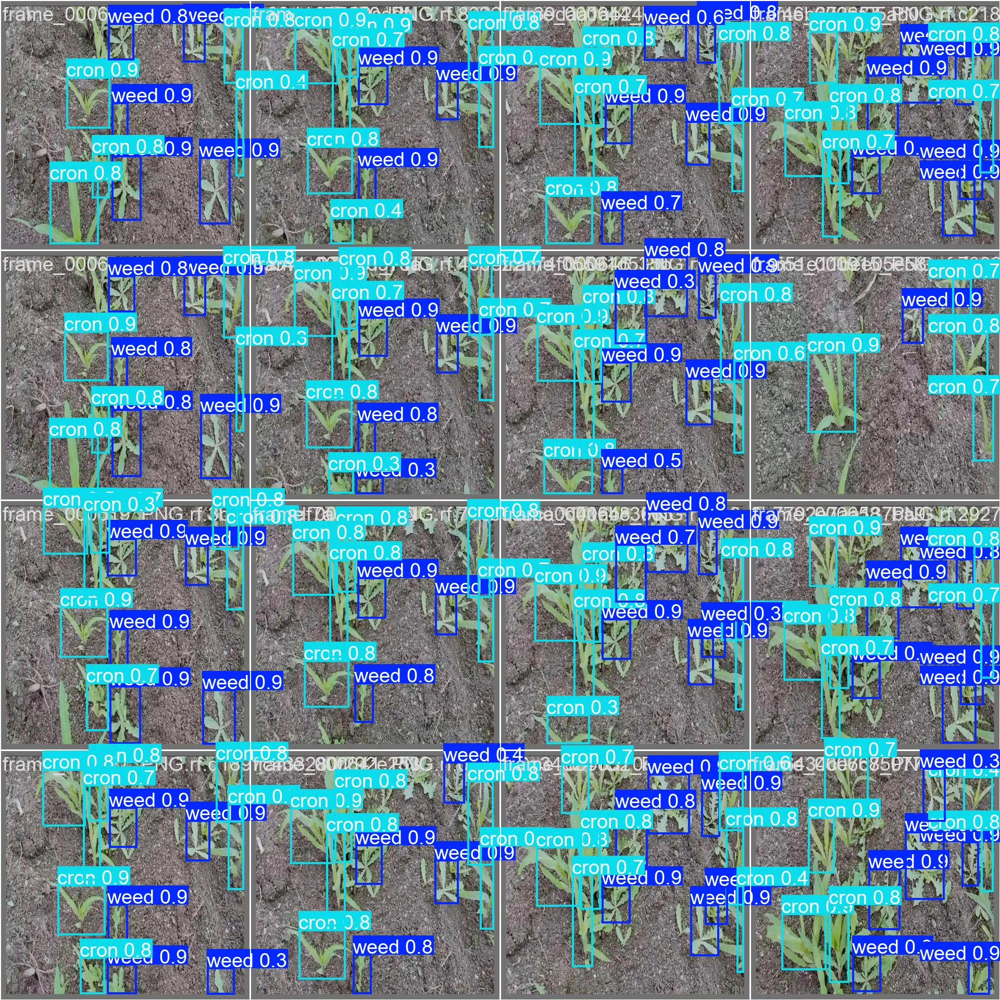
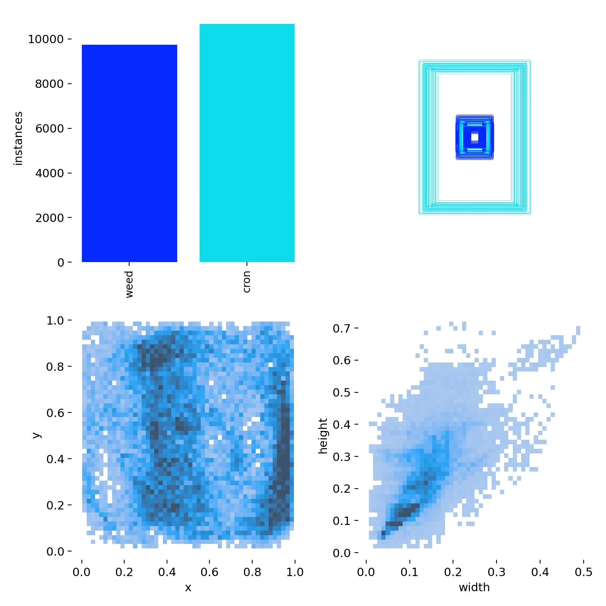
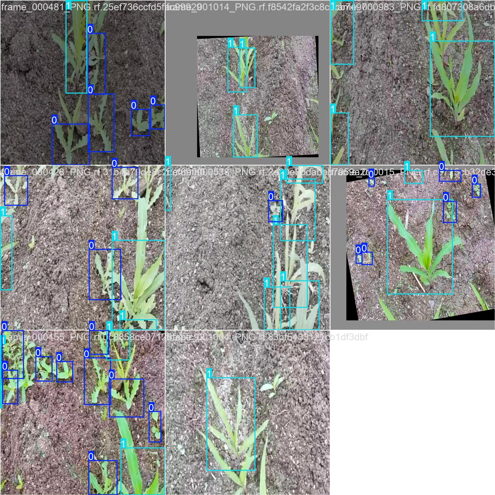

# Based on YOLOv8 deep learning for corn seedling weed detection system (YOLOv8)

## Body

Based on the advanced YOLOv8 object detection algorithm, this project has developed an efficient intelligent identification system for corn seedling weeds in the field. It is specifically designed to distinguish between corn seedlings ("corn") and weeds ("weed"). The system utilizes a dataset containing 3042 high-quality field images, with 2661 training images, 254 validation images, and 127 test images. Through deep learning techniques, it achieves high-precision detection and localization of corn seedlings and weeds. This system can monitor the growth status of crops in the field in real-time, providing reliable visual perception support for automated weeding operations in precision agriculture, which holds significant agricultural production application value.

The company's products have obtained the YOLO official commercial license certification.

We provide after-sales service.

After payment, we will provide WeChat ID for any questions.

Environmental configuration: We will provide a tutorial on environmental configuration, and WeChat will provide answers to questions.

Remote installation service: If you need remote configuration, an additional fee of 69 is required,

Configuration failure will result in all fees being refunded (only installation fees are refundable for older computers).

Retraining dataset: After setting up the environment, you can train on your own computer.
If you need us to retrain, just pay 69 + computing power fees (2.5 yuan/hour)

## Images

## Payment

Here is a pay link on Stripe ( https://buy.stripe.com/3cs8yP7sY87d0vu9AB ). Please contact me lonlonago@foxmail.com after funding $89, and I will send you a complete data files , thank you!

